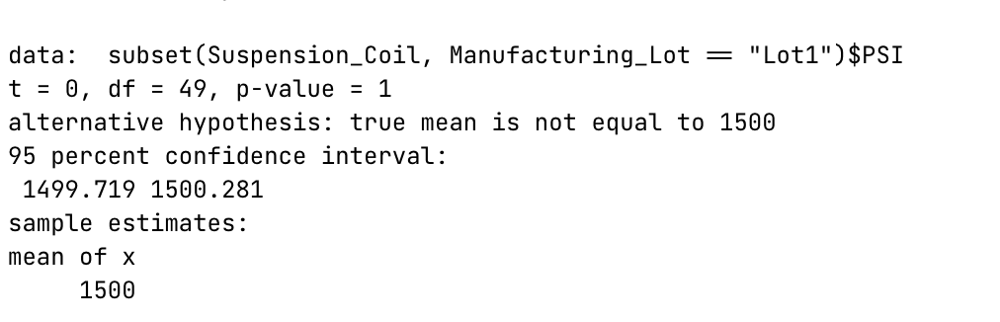
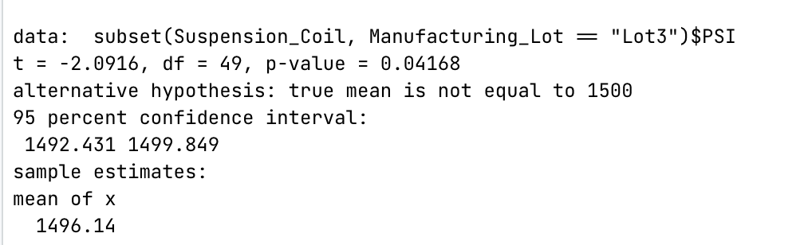

# MechaCar Statistical Analysis

## Linear Regression to Predict MPG 
- The **vehicle length** and **ground clearance** have a statistical significance on miles per gallon. Both  have p_levels below the significance level of 0.05% 
- The multiple r-square value of 0.7149 and p_value below the significance level of 0.05% would give evidence to reject the null hypothesis indicating the slope is not zero. 
- The linear mode is a good indicator due the multiple r-square value of 0.7149 and p-value of 5.35e-11. The r-square indicates about 71% of predictions would be correct using this model. 

## Summary Statistics on Suspension Coils 
>  The design specifications are not to exceed a variance of 100 PSI. 

Overall the PSI variance is 62.3 which meets the specifications. However looking at it from a lot perspective **lot 3 does not meet the specifications**. 

## T-Tests on Suspension Coils 

#### Population t-test 
Collectively the all the lots have a p-value of 0.06028 which is above the significance level of 0.05% so therefore indicates it is not significantly different from the population mean. 

#### Lot t-test 
The lot t-test show a different result that the population test. Lots 1 and 2 have p-values of 1 and 0.6072  which indicated they are not significantly different that the population mean, but lot 3 has a p-value of 0.04168 which indicates it is significantly different than the population mean. 

## Study Design: MechaCars vs Competition 
To compare the competition we would first need to understand our target market and what is important to them. For our market we choosing features that appear to the average family with children. 
#### Metric to test 
Metrics that we feel important to our market 
- Safety rating 
- Fuel mileage (MPG) 
- Maintenance Cost Rating 
- Selling Price 

#### Null or alternative hypothesis 
Ho - MechaCars are not significantly different than the competitor 
Ha - MechaCars are significantly different that the competition in one or more metrics 

#### Statistical test 
A one tailed t-test could be performed to know if there is any factor that significantly sets MechaCars apart from the competitor. In particular how they get a better saftety rating, MPG or Mentance Cost Rating for the price they are paying. 

A regression analysis test could also be done to see what if any factors are signficantly related to Selling Price. If these stand out they could be used as part of advertising "value" for the dollar.. 

#### Data for the test 
We would collect Safety Rating, Fuel mileage, Maintenance Cost Ratings and Selling Prices of competitive models. 