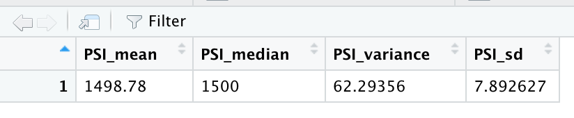

# MechaCar Statistical Analysis

## Linear Regression to Predict MPG 
- The **vehicle length** and **ground clearance** have a statistical significance on miles per gallon. Both  have p_levels below the significance level of 0.05% 
- The mutiple r-square value of 0.7149 and p_value below the significance level of 0.05% would given evidence that to reject the null hypothesis indicating the slope is not zero. 
- The linear mode is a good indicator due the multiple r-square value of 0.7149 and p_value of 5.35e-11. The r-square indicates about 71% of predictions would be correct using this model. 

## Summary Statistics on Suspension Coils 
>  The design specifications are not to exceed a variance of 100 PSI. 

Overall the PSI variance is 62.3 which meets the specifications. However looking at it from a lot perspective **lot 3 does not meet the specifications**. 

