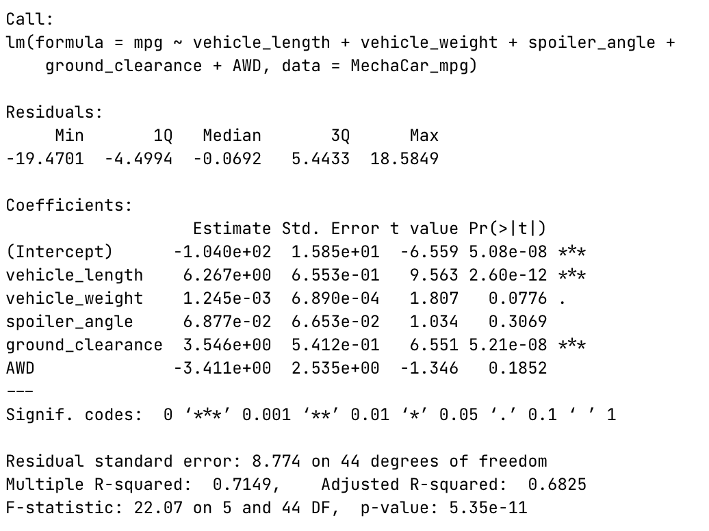
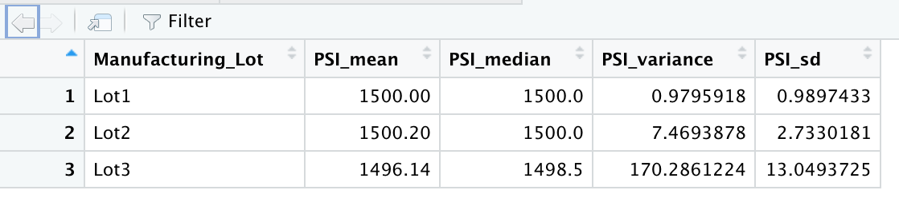
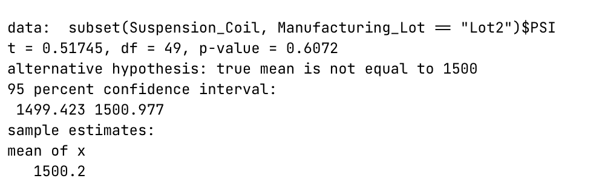

# MechaCar Statistical Analysis

## Linear Regression to Predict MPG 
- The **vehicle length** and **ground clearance** have a statistical significance on miles per gallon. Both  have p_levels below the significance level of 0.05% 
- The mutiple r-square value of 0.7149 and p_value below the significance level of 0.05% would give evidence to reject the null hypothesis indicating the slope is not zero. 
- The linear mode is a good indicator due the multiple r-square value of 0.7149 and p-value of 5.35e-11. The r-square indicates about 71% of predictions would be correct using this model. 

## Summary Statistics on Suspension Coils 
>  The design specifications are not to exceed a variance of 100 PSI. 

Overall the PSI variance is 62.3 which meets the specifications. However looking at it from a lot perspective **lot 3 does not meet the specifications**. 

## T-Tests on Suspension Coils 

#### Population t-test 
Collectively the all the lots have a p-value of 0.06028 which is above the significance level of 0.05% so therefore indicates it is not signficantly different from the population mean. 

#### Lot t-test 
The lot t-test show a differnet result that the population test. Lots 1 and 2 have p-values of 1 and 0.6072  which indicated they are not significantly different that the popultion mean, but lot 3 has a p-value of 0.04168 which indicates it is significantly different than the population mean. 

## Study Design: MechaCars vs Competition 
#### Metric to test 
#### Null or alternative hypothesis 
#### Statistical test 
#### Data for the test 